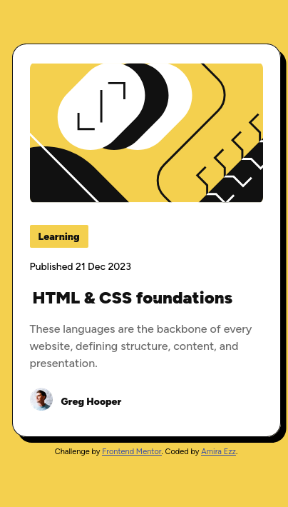
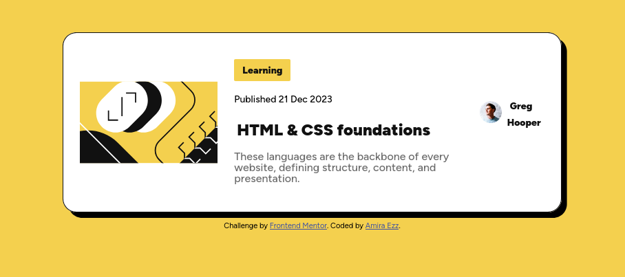
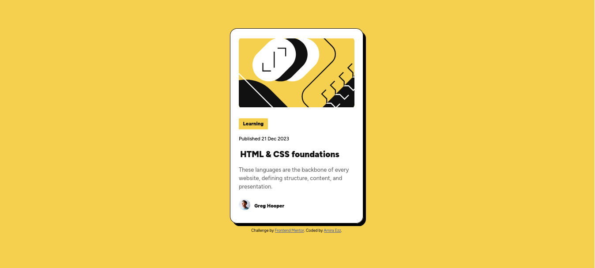

# Frontend Mentor - Blog preview card solution

This is a solution to the [Blog preview card challenge on Frontend Mentor](https://www.frontendmentor.io/challenges/blog-preview-card-ckPaj01IcS). Frontend Mentor challenges help you improve your coding skills by building realistic projects. 

## Table of contents

- [Overview](#overview)
  - [The challenge](#the-challenge)
  - [Screenshots](#screenshots)
  - [Links](#links)
- [My process](#my-process)
  - [Built with](#built-with)
  - [What I learned](#what-i-learned)
  - [Continued development](#continued-development)
- [Author](#author)

## Overview

### The challenge

Users should be able to:

- See hover and focus states for all interactive elements on the page

### Screenshots

### Links

- [Solution URL](https://github.com/dev-amira-ezz/blog-preview-card)
- [Live Site URL](https://dev-amira-ezz.github.io/blog-preview-card/)

## My process

### Built with

- Semantic HTML5 markup
- CSS Flexbox
- Mobile-first workflow

### What I learned
- I learned that sometimes trying to have perfect, semantic code makes things more complicated. I simply divided the main area into sections.
- Media query doesn't have to be very complicated.
- Classes make things very easy. I just add the same class to all the elements that I want to add the feature to.
- I practiced doing pull request in this project to simulate real life work flow.

### Continued development

I can do this project again with React. I might also use Tailwind.

## Author

- Frontend Mentor - [@dev-amira-ezz](https://www.frontendmentor.io/profile/dev-amira-ezz)
- Twitter - [@AmiraEzz4007](https://x.com/AmiraEzz4007)

